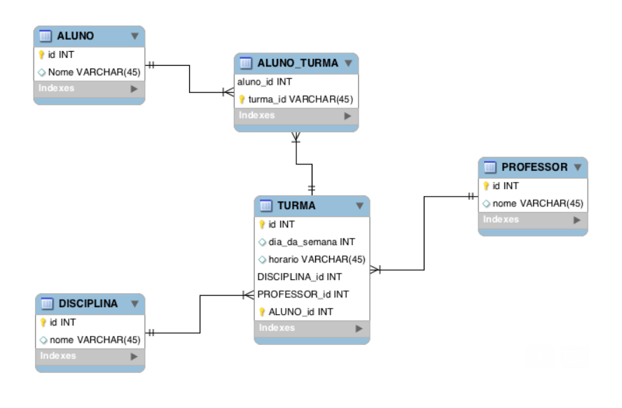

# Teste Esparta

Repositório criado para guardar as resoluções das questões proposta pelo time da Esparta.

## Questões
- Link para o enunciado das questões: https://gist.github.com/esparta-io/945c0f95d96b04be7509b53a10485147

### Para rodar
- Para rodar as resoluções:
  ( * = numero_da_questao ) 
  - `$ cd *`
  - `$ tsc *.ts; node *.js`

## Parte de banco de dados
- A parte das respostas para as questões de banco de dados está em um arquivo separado na raiz do projeto.

- Imagem do banco para a resolução das perguntas:
